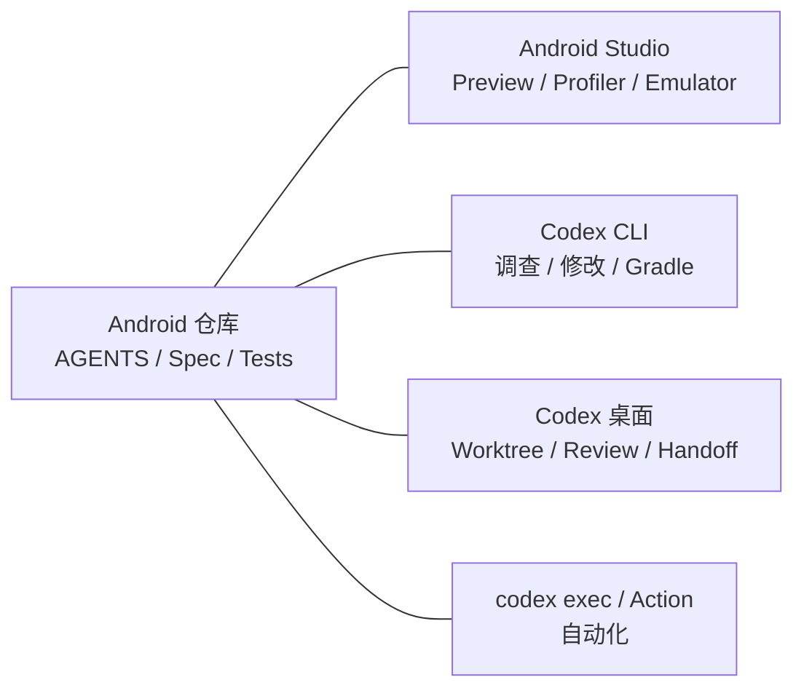

# 03｜系统地图：为 Android 任务选择正确的 Codex 入口

上一讲建立了 Spec → Plan → Tasks → Code → Evidence 的工程主线。这一讲解决一个更实际的问题：Codex 有 CLI、IDE 扩展、桌面应用、Cloud 和自动化接口，Android 开发时到底该用哪一个？

本讲结束后，你应该能够：

- 说清不同 Codex 入口各自负责什么；
- 正确处理 Codex 与 Android Studio 的关系；
- 根据任务的上下文、风险和持续时间选择入口；
- 知道哪些项目规则能跨入口复用，哪些状态不能。

## 先纠正一个最容易产生的误解

Codex 的官方 IDE 扩展面向 VS Code 及兼容编辑器。它可以读取打开的文件、选区和诊断，但不能据此推导出“Codex 有官方 Android Studio 插件”。

Android 团队更常见的组合是：

```text
Android Studio：Sync、Compose Preview、Profiler、Layout Inspector、模拟器
Codex CLI／桌面应用：搜索、修改、运行 Gradle、审查 diff、管理长任务
VS Code + Codex 扩展：需要贴近选区进行文本编辑时使用
Computer Use：只有任务必须操作图形界面时才考虑
```

如果你一直使用 Android Studio，不需要为了使用 Codex 把整个项目迁到另一个编辑器。让 Android Studio 做最擅长的 Android 专业工作，让 Codex 在同一个仓库中完成调查、修改和验证即可。

> Claude Code 官方提供 JetBrains 插件并明确覆盖 Android Studio；这不是 Codex 当前 IDE 扩展的等价能力。迁移时必须把这项差异单独说明。

## 六个入口，一套项目规则

| 入口 | 最适合 | Android 示例 | 需要注意 |
|---|---|---|---|
| CLI | 本地仓库调查、修改和命令执行 | 追踪 `StateFlow`、运行 Gradle 测试 | 看不到 Compose Preview 图形结果 |
| IDE 扩展 | 围绕打开文件、选区和诊断协作 | 在 VS Code 中解释一个 Kotlin 文件 | 不是 Android Studio 官方插件 |
| ChatGPT 桌面应用中的 Codex | 多任务、Git 审查、Worktree、Handoff | 后台重构后移交到 Local 验证 | Worktree 依赖 Git；本地环境需单独设置 |
| Codex Cloud | 托管环境中的并行或耗时任务 | 批量调查模块、准备候选补丁 | 云环境必须能够独立恢复依赖与配置 |
| `codex exec` / SDK / Action | 非交互脚本与 CI | 生成结构化审查结果、分析失败日志 | 默认权限、凭据和输出协议必须显式设计 |
| Computer Use | 必须通过视觉界面完成的工作 | 操作 Android Studio、模拟器或 Layout Inspector | 会影响项目之外的桌面状态，必须限制应用权限 |

这些入口共享的不是聊天历史，而是仓库中的工程事实：

- `AGENTS.md` 和嵌套覆盖规则；
- `.codex/config.toml`、Rules、Hooks 和 Agent 配置；
- `.agents/skills/` 中的团队 Skill；
- Spec、测试、Gradle Wrapper 和 Git 历史。

某些能力具有入口限制。例如 Local environment 和 Codex 托管 Worktree 属于桌面应用；Computer Use 属于支持地区和平台中的桌面能力；CLI 会话命令也不应假设在每个入口完全相同。



## 一项真实任务怎样穿过多个入口

假设 PocketTasks 旋转屏幕后重复显示错误 Snackbar。

### 第一步：Android Studio 复现

在模拟器中复现问题，记录：

- Android 版本和设备；
- 操作步骤；
- Logcat 中的异常或事件记录；
- 旋转前后的截图。

图形证据可以直接拖入桌面应用，也可以从 CLI 启动时附加：

```bash
codex -i evidence/before.png -i evidence/after.png
```

### 第二步：CLI 调查事实源

```text
只调查，不修改。追踪错误 Snackbar 从 Repository 到 ViewModel、
再到 Composable 的完整生产和消费路径。列出文件、状态类型、
生命周期边界和当前测试缺口。
```

Codex 可以运行：

```bash
rg -n "Snackbar|SharedFlow|Channel|UiEvent" app/src
./gradlew :app:testDebugUnitTest
```

### 第三步：长任务进入 Worktree

如果修复需要比较两种事件建模方案，在桌面应用中新建 Worktree 任务。Worktree 默认可能处于 detached HEAD；验证方案后，通过 **Create branch here** 建立分支，或使用 **Handoff** 把聊天和改动移回 Local。

### 第四步：Android Studio 做专业验证

Handoff 到 Local 后，用 Android Studio 执行：

- Compose Preview 检查；
- 模拟器旋转验证；
- Layout Inspector 或 Profiler 检查；
- 必要的设备测试。

### 第五步：CI 做独立复核

CI 从干净环境重新执行 Wrapper、单元测试、Lint 和构建。CI 成功证明的是“仓库能够在该环境中复现验证”，不是“Codex 在本地说已经完成”。

## 用四个问题选择入口

面对任务时，依次问：

1. **证据在哪里？** 在代码里、截图里、Android Studio 图形界面里，还是外部系统里？
2. **任务会持续多久？** 五分钟调查、半天重构，还是定期运行？
3. **允许影响什么？** 只读仓库、写工作区、使用网络，还是操作桌面应用？
4. **结果怎样验证？** 静态搜索、JVM 测试、设备测试、人工视觉确认还是 CI？

| 情况 | 推荐入口 |
|---|---|
| 只读追踪 Kotlin 调用链 | CLI |
| 围绕 VS Code 当前选区进行局部修改 | IDE 扩展 |
| 同时尝试两个互斥方案 | 桌面应用 Worktree |
| 必须查看或点击 Android Studio UI | 人工操作；必要时受控 Computer Use |
| 每个 PR 生成机器可读审查 | `codex exec` 或 Codex Action |
| 每周检查依赖和测试漂移 | Scheduled task + 稳定 Skill |

## Codex、Claude Code、Cursor 怎样选择

这不是品牌排名，而是工作表面选择。

| 团队现状 | 更自然的起点 |
|---|---|
| 重度依赖 Android Studio 内联协作 | Claude JetBrains 插件，或 Android Studio + Codex CLI 双轨 |
| 希望统一 CLI、桌面 Worktree、后台任务和 CI | Codex |
| 已围绕 Cursor 编辑器建立大量 `.mdc` 规则 | 先保留 Cursor 编辑体验，再逐步引入 Codex CLI |
| 需要大量浏览器或桌面图形操作 | 比较各产品当前 Computer Use 能力和组织权限后再选 |

选择工具以后，仍应把团队知识落在普通文件、测试和 Git 中，避免项目被某个聊天窗口锁定。

## 本讲实践：给三个任务分配驾驶位

为下面任务分别写出“入口—原因—验证—回退”：

1. 修改一个按钮文案；
2. 调查 Room 升级后数据丢失；
3. 每周检查 Compose 和依赖升级风险。

参考答案：

| 任务 | 入口 | 验证 | 回退 |
|---|---|---|---|
| 文案修改 | CLI 或 IDE 扩展 | 资源检查、Lint、截图 | Git 恢复单文件 |
| Room 事故 | CLI 调查 + Worktree 修复 + Android Studio 验证 | Migration 测试和旧库样本 | 独立分支、保留数据库备份 |
| 周期检查 | Skill 稳定后建立 Scheduled task | 每次运行报告与人工审批 | 暂停计划任务，不自动改代码 |

## 完成标志

你能够明确说出：Codex 不等于 Android Studio 插件；每个入口都有边界；真正跨入口复用的是仓库事实和验证合同。

## 延伸阅读

- [Codex IDE 扩展](https://developers.openai.com/codex/ide/)
- [Codex Worktrees 与 Handoff](https://learn.chatgpt.com/docs/environments/git-worktrees)
- [Codex 图片输入](https://learn.chatgpt.com/docs/image-inputs)
- [Codex Computer Use](https://learn.chatgpt.com/docs/computer-use)
- [Claude Code JetBrains 集成](https://code.claude.com/docs/zh-CN/jetbrains)
