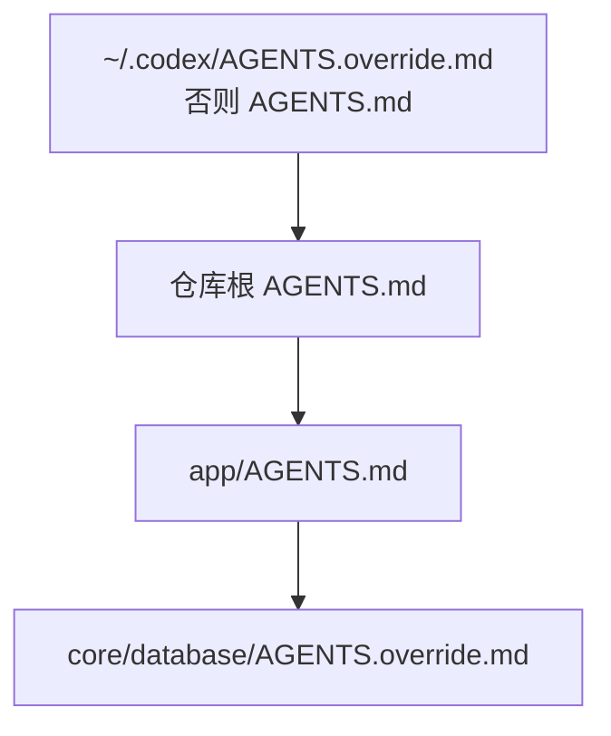

# 06｜项目指令与记忆：AGENTS.md、覆盖规则和 Memories

新人第一次进入 Android 仓库时，最怕的不是文件多，而是不知道哪些约定必须遵守：模块怎样分层、哪些命令可信、Room 迁移有什么禁区、完成任务前必须提供什么证据。

Codex 需要同样的入职材料，但这里有两个不能混为一谈的概念：

- `AGENTS.md` 是团队提交到仓库的正式项目指令；
- Memories 是 Codex 可选的本地回忆层，用来带回过去会话中的有用背景。

必须执行的规则写进仓库。个人偏好或历史线索可以进入 Memories，但不能成为团队唯一的事实源。

## 本讲目标

学完后，你应该能够：

- 解释 Codex 怎样寻找和合并 `AGENTS.md`；
- 为 Android 仓库编写短小、可验证的项目指令；
- 用嵌套文件或 override 处理局部差异；
- 用 `/debug-config` 调查实际生效配置；
- 正确开启、关闭和审查 Memories。

## AGENTS.md 到底是什么

把它想成“Codex 进入目录时必须先读的工作说明”，适合记录：

- 项目结构和事实入口；
- 已验证的构建、测试和 Lint 命令；
- 架构边界与修改禁区；
- Android 特有的迁移、生命周期和无障碍要求；
- 团队期望的调查、实现、验证和汇报方式。

它不适合记录：

- API Key、签名口令或内部个人信息；
- 会快速过期的任务状态；
- 大段可从代码或官方文档直接推导的知识；
- “写出高质量代码”这类无法判定是否遵守的口号。

配套项目中的真实文件是 [`配套文件/PocketTasks-codex/AGENTS.md`](./配套文件/PocketTasks-codex/AGENTS.md)。

## Codex 怎样发现项目指令

发现过程分为两层。

### 第一层：个人全局指令

Codex 先检查 Codex home，默认是 `~/.codex`：

1. 如果存在非空的 `~/.codex/AGENTS.override.md`，读取它；
2. 否则读取 `~/.codex/AGENTS.md`；
3. 这一层只采用第一个符合条件的文件。

全局文件适合个人通用偏好，例如“汇报时列出实际运行的测试”。不要把只属于 PocketTasks 的 Room 规则放在这里。

### 第二层：项目目录链

Codex 从项目根目录一路走到当前工作目录。在经过的每一级目录中，按以下顺序取最多一个文件：

```text
AGENTS.override.md → AGENTS.md → 配置的 fallback 文件名
```

越靠近当前目录的内容越晚加入上下文，因此可以针对局部模块给出更具体的规则。

例如：

```text
PocketTasks/
├── AGENTS.md                         # 全项目通用规则
├── app/
│   └── AGENTS.md                     # Compose 与 UI 测试规则
└── core/database/
    └── AGENTS.override.md            # Room 迁移的严格覆盖规则
```



项目指令合计默认最多读取 32 KiB，受 `project_doc_max_bytes` 控制。超过上限时，不要第一反应就是无限提高数值；先删除重复内容，把局部规则放到对应子目录。

## 为 PocketTasks 写一份可执行的入职页

一份好的根指令首先给 Codex导航：

```markdown
# PocketTasks 工作指南

## 先读什么
- 需求：specs/001-task-filter/spec.md
- 实施计划：specs/001-task-filter/plan.md
- 团队原则：docs/constitution.md

## 项目结构
- app/src/main/.../ui：Compose 与 ViewModel
- app/src/main/.../data：Room、DataStore、Repository
- app/src/test：JVM 单元测试
- app/src/androidTest：Compose 与数据库迁移测试

## 验证命令
- 快速：./gradlew :app:testDebugUnitTest
- 完整本地：./gradlew :app:testDebugUnitTest :app:lintDebug :app:assembleDebug
- 设备测试：./gradlew :app:connectedDebugAndroidTest

## 工作边界
- 修改前先调查事实源和测试。
- Room schema 变化必须更新版本、Migration 和迁移测试。
- 不提交 local.properties、签名文件或凭据。
- 完成时报告实际运行的命令；未运行的验证必须明确说明。
```

这几条都能通过文件、diff 或命令结果检查。相反，“保持优雅”“尽量完善”无法形成稳定合同。

## 用嵌套规则处理 Android 高风险区域

数据库目录可以增加更严格的 `AGENTS.override.md`：

```markdown
# Room 数据库覆盖规则

- 禁止 destructive migration。
- 修改 Entity 前先读取已导出的 schema。
- 每次升级必须提供 `MigrationTestHelper` 测试。
- 测试至少从仍受支持的最老版本迁移到当前版本。
- 不得删除旧 schema JSON。
```

为什么使用 override？因为这里希望替换同目录的普通 `AGENTS.md`，并把“数据不可丢失”提升为明确局部边界。大多数情况使用普通嵌套 `AGENTS.md` 就够了，不必到处创建 override。

## 项目信任会影响什么

项目 `.codex/config.toml`、项目 Hooks 和 Rules 都可能执行或放宽能力，因此 Codex 只在受信任项目中加载相关项目层配置。刚克隆陌生仓库时，先审查：

```bash
sed -n '1,240p' AGENTS.md
sed -n '1,240p' .codex/config.toml
sed -n '1,260p' .codex/hooks.json
rg --files .codex .agents
```

信任项目不等于“以后所有命令都自动安全”。它只是允许项目层定制参与配置，沙箱、审批和 Hook 仍然各自生效。

## 用 `/debug-config` 调查实际生效内容

当 Codex 的行为和预期不一致时，不要凭感觉继续加规则。在 CLI 中输入：

```text
/debug-config
```

重点检查：

- 项目根目录是否识别正确；
- 哪些配置层参与合并；
- 是否存在上层 `AGENTS.override.md`；
- `project_doc_max_bytes` 是否导致截断；
- 项目是否处于 trusted 状态；
- 管理员 `requirements.toml` 是否限制了某项配置。

然后用一个只读问题验证指令是否被理解：

```text
不要修改文件。根据当前项目指令，列出本项目的快速验证、
完整验证和 Room schema 变更要求，并标出这些要求来自哪个文件。
```

预期结果不是逐字背诵，而是来源、作用域和命令都正确。

## Memories 是另一层能力

Memories 可以把过去聊天中有用的上下文带到未来聊天。ChatGPT Web 的记忆与本地 Codex 客户端使用的记忆存储并不相同；本地 Codex Memories 默认关闭，主要文件位于：

```text
~/.codex/memories/
```

在配置中开启：

```toml
[features]
memories = true
```

在 CLI 或桌面聊天中输入：

```text
/memories
```

你可以控制当前聊天是否读取已有记忆，以及是否允许它为未来生成记忆。聊天级选择不会替代全局设置。

### 适合进入 Memories 的内容

- 你偏好先看测试失败再看实现；
- 某个长期项目常用的解释背景；
- 过去调查形成、但仍需重新验证的线索。

### 不应只存在 Memories 中的内容

- 发布必须运行哪些命令；
- Room 不允许 destructive migration；
- 团队代码风格；
- 模块归属和审查责任；
- 密钥、令牌和签名信息。

最简单的判断是：如果同事换一台电脑仍然必须知道，就写进仓库，而不是只留在 Memories。

## 常见失败方式

### 文件太长

表现：规则互相重复，重要命令被淹没，甚至触发字节上限。

修正：根文件只保留全局合同，模块细节下沉到嵌套文件，长教程放普通文档并从 AGENTS 链接。

### 写了不存在的命令

表现：Codex 每次都以同一种方式失败。

修正：先在干净环境执行命令，再写入 AGENTS；版本、模块名和测试任务必须与仓库一致。

### 把 Memory 当政策

表现：不同电脑、不同同事得到不一致行为。

修正：把必须执行的要求迁回 AGENTS、测试、Rules 或 Hook。

### 复制同一条规则到四处

表现：一次修改后出现互相冲突的版本。

修正：只保留一个事实源，其他位置使用链接或更窄的补充规则。

## 本讲实践

1. 打开配套 [`AGENTS.md`](./配套文件/PocketTasks-codex/AGENTS.md)。
2. 检查里面每条 Gradle 命令是否能从仓库根目录运行。
3. 为数据库目录设计一个不超过 12 行的嵌套规则。
4. 使用 `/debug-config` 记录实际加载层。
5. 打开 `/memories`，确认当前聊天的读取和生成策略。

## 完成标志

- 你能画出全局与项目指令的发现顺序；
- `AGENTS.md` 中没有密钥和空泛口号；
- 关键命令已经实际运行；
- 你能解释 AGENTS 和 Memories 为什么不能互相替代。

## 延伸阅读

- [Codex AGENTS.md 指南](https://learn.chatgpt.com/docs/customization/agents-md)
- [Codex 高级配置与项目指令发现](https://learn.chatgpt.com/docs/config-file/config-advanced#project-instructions-discovery)
- [Codex Memories](https://learn.chatgpt.com/docs/customization/memories)
