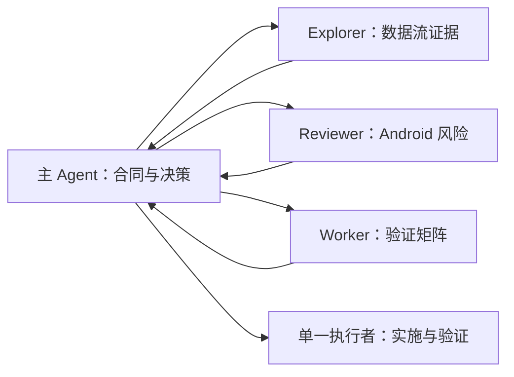

# 14｜协作分工：用 Subagents 拆解复杂任务

一个 Android 改动可能同时涉及 Compose、协程、Room 和测试。把全部日志和探索过程塞进主会话，会让需求和关键决策被噪音淹没。Subagent 的作用，是把独立调查放到单独线程，再把结论浓缩回主线程。

这不是“Agent 越多越好”。每个子代理都会独立消耗模型和工具资源；边界不独立时，多代理只会增加冲突和协调成本。

## 什么适合并行，什么不适合

适合先并行的是读密集任务：

- 一个 Agent 追踪 Compose 状态与生命周期；
- 一个 Agent 检查 Room 迁移和数据安全；
- 一个 Agent 盘点测试缺口与实际可运行命令；
- 主 Agent 保留 Spec、取舍和最终合并判断。

不适合直接并行的是：三个 Agent 同时改 `TaskViewModel.kt`、同一份 Version Catalog 或同一 Room Schema。先并行调查，再由一个执行者修改，通常更可靠。



## Codex 中怎样触发 Subagent

当前 Codex CLI、桌面应用和 IDE 扩展都能显示子代理活动。最可靠的触发方式是明确提出委派，也可以让适用的 `AGENTS.md` 或 Skill 规定必须委派。

```text
请使用三个并行 Subagent，只读审查当前分支相对 main 的改动：
1. android-explorer：追踪 UI 事件到 Room 的状态与数据流；
2. android-reviewer：检查 Compose 生命周期、协程、Room 和无障碍缺陷；
3. worker：只运行已有验证并区分通过、失败、跳过与环境不可用。
等待全部结果后，由主 Agent 去重、核验证据并给出一份结论。
任何 Agent 都不要修改文件。
```

在 CLI 中使用 `/agent` 查看和切换 Agent 线程。桌面应用可打开子代理线程；IDE 在支持时会显示后台 Agent 面板。也可以直接要求 Codex停止或继续某个子代理。

## 内置 Agent 与项目自定义 Agent

Codex 提供三个内置角色：

- `default`：通用后备；
- `worker`：偏实现与修复；
- `explorer`：偏只读探索。

个人自定义 Agent 放在 `~/.codex/agents/`，项目 Agent 放在 `.codex/agents/`。课程项目提供：

- [`android-explorer.toml`](./配套文件/PocketTasks-codex/.codex/agents/android-explorer.toml)
- [`android-reviewer.toml`](./配套文件/PocketTasks-codex/.codex/agents/android-reviewer.toml)

一个最小自定义 Agent 包含：

```toml
name = "android-reviewer"
description = "Read-only reviewer for Android correctness and platform risks"
sandbox_mode = "read-only"

developer_instructions = """
Review the assigned diff without editing files. Read project instructions,
the relevant spec, and the complete diff. Report evidence-backed findings.
"""
```

`name`、`description`、`developer_instructions` 是必需字段；文件名只是惯例，真正身份来自 `name`。没有必要在课程里锁死某个模型名称，让 Agent 默认继承父会话即可。

## 并发和默认值放在哪里

全局设置位于配置的 `[agents]`：

```toml
[agents]
enabled = true
max_concurrent_threads_per_session = 3
```

还可以配置子代理默认模型与推理强度，但越具体越需要团队维护版本和成本策略。并发上限限制的是子代理线程，不包括主线程。

## 权限不是每个 Agent 各自随意选择

Subagent 继承父轮次当前的沙箱和审批模式，包括通过 `/permissions` 临时改变的实时设置。自定义 Agent 可以进一步声明 `sandbox_mode = "read-only"`，但不能把父级没有授权的能力凭空扩大。

这带来三个操作规则：

1. 委派前先设置父会话权限；
2. 调查与评审 Agent 显式只读；
3. 非交互环境无法弹出新审批时，需要额外权限的动作会失败并返回主流程。

CLI 即使当前停留在主线程，也可能弹出另一个 Agent 的审批。审批界面会标明来源；先打开来源线程看清命令和上下文，再决定是否放行。

## 子任务合同必须能独立完成

一个好委派要写清五件事：

| 字段 | PocketTasks 示例 |
|---|---|
| 范围 | 只读 `data/`、Schema 和迁移测试 |
| 问题 | v1→v2 是否保留任务并注册到生产 builder |
| 输出 | 结论、路径与行号、未知项、下一步 |
| 权限 | 不改文件，不清数据库，不启动发布 |
| 汇合 | 等待全部结果，由主 Agent 去重核验 |

“帮我看看数据库”范围太宽；“分析整个项目并直接修好”又把调查、决策和写入混在一起。

## 一次真实练习

在课程项目根目录启动 Codex，先用 `/permissions` 选择只读，然后提交：

```text
使用两个 Subagent 并行完成只读调查，并等待两者结束：
- android-explorer：追踪筛选从 Compose 点击到 DataStore，再回到 uiState 的路径；
- android-reviewer：检查 Room v1→v2 迁移类、Schema、测试和生产注册是否一致。
每个结论必须带文件路径；不要修改文件，不要运行设备数据清理命令。
最后由主 Agent 输出：共同事实、分歧、未验证项和最小下一步。
```

验收时检查：子代理是否真的分成两个线程；是否都保持只读；主 Agent 是否核对而非简单拼接；是否把“未运行设备测试”准确写出。

## 何时退回单 Agent

出现以下任一情况，改用单 Agent：任务只需几十秒；所有工作都触碰同一文件；下一步依赖上一步的结论；决策频繁需要用户确认；并行成本大于等待成本。

## 小结

Subagent 的核心不是数量，而是上下文隔离和清晰汇合。先把独立、读密集的任务委派出去，权限从父会话收紧，最后由主 Agent 对证据负责；写密集修改则优先交给单一执行者。

下一讲将把同样的边界带进非交互环境：没有人守在终端时，`codex exec` 怎样输出机器可读结果、怎样限制权限、怎样安全进入 CI。

## 延伸阅读

- [Codex Subagents](https://developers.openai.com/codex/subagents/)
- [课程自定义 Agents](./配套文件/PocketTasks-codex/.codex/agents/android-reviewer.toml)

