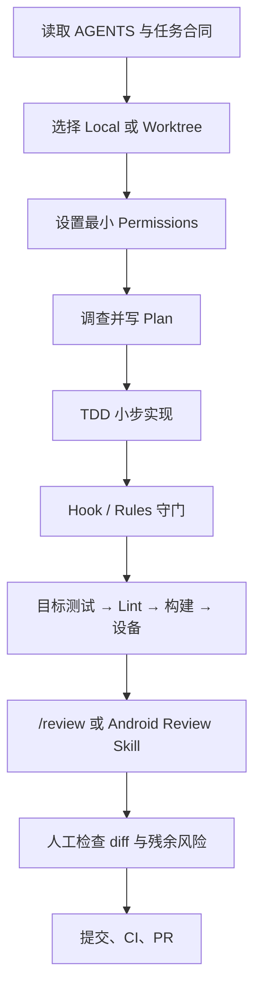

# 16｜顶层设计：搭建 Android 项目驾驶舱

到这里，我们已经有 `AGENTS.md`、Spec、Rules、Hooks、Skills、Subagents 和自动化。真正的难点不是继续加文件，而是让团队知道：遇到一项 Android 任务，从哪里进入、谁做决定、怎样证明完成。

“驾驶舱”不是 Codex 的某个功能名，而是本课程对一组工程资产的总称。它把知识、任务、执行、安全和证据放在各自正确的位置。

## 先看完整结构

课程可运行项目位于 [`配套文件/PocketTasks-codex`](./配套文件/PocketTasks-codex/)：

```text
PocketTasks-codex/
├── AGENTS.md                         团队长期工程规则
├── docs/constitution.md             跨需求的设计原则
├── specs/
│   ├── 000-template/                 Spec / Plan / Tasks 模板
│   └── 001-task-filter/              已完成的真实功能合同
├── app/                              Compose / Room / DataStore 与测试
├── .agents/skills/android-code-review/
│   ├── SKILL.md                      可复用审查方法
│   ├── agents/openai.yaml            UI 元数据
│   └── references/                   按改动类型加载的检查表
├── .codex/
│   ├── config.toml                   项目安全起点
│   ├── rules/default.rules           命令政策
│   ├── hooks.json                    生命周期门禁
│   ├── hooks/                        Hook 实现与测试
│   └── agents/                       Android 专用子代理
├── .worktreeinclude                  托管 Worktree 本地文件清单
├── scripts/codex-readonly-review.sh  非交互审查入口
└── .github/                           Android CI 与 Codex Action 示例
```

这不是必须一口气复制的模板。每多一层，团队都要承担审查、测试和升级成本。

## 五层资产，各自只回答一种问题

| 层 | 回答的问题 | 课程资产 |
|---|---|---|
| 项目知识 | 在这个仓库怎样工作 | `AGENTS.md`、局部说明 |
| 产品合同 | 这次要实现什么 | `spec.md` |
| 技术路线 | 为什么这样改、按什么顺序 | `plan.md`、`tasks.md` |
| 执行能力 | 哪套成熟方法可以复用 | Skills、Subagents、MCP |
| 安全与证据 | 什么能做，怎样证明 | Permissions、Rules、Hooks、测试、CI |

常见错误是把所有内容塞进 `AGENTS.md`。例如“每次 PR 都如何审查 Compose”是 Skill；“这个功能冷启动必须恢复筛选”是 Spec；“禁止自动清真机数据”是 Rules 或 Hook。

## 从空仓库到最小驾驶舱

### 第一步：只放可验证的项目说明

根 `AGENTS.md` 先写模块、命令、边界和完成定义。课程版本已经给出可运行命令：

```bash
./gradlew :app:testDebugUnitTest
./gradlew :app:lintDebug :app:assembleDebug
```

仪器测试必须有设备：

```bash
adb devices
./gradlew :app:connectedDebugAndroidTest
```

### 第二步：为真实需求写 Spec / Plan / Tasks

复制 `specs/000-template/`，只替换一个明确功能。不要为了“工程化”先创建几十个空目录。PocketTasks 的 `001-task-filter/` 已经演示需求、路线和任务的对应关系。

### 第三步：把重复判断变成安全机制

先从一个高价值政策开始：禁止自动清除设备数据。固定前缀写 Rules，需要解析上下文的情况写 Hook；Hook 本身必须有自动测试。

### 第四步：稳定流程才做成 Skill

团队完成几次 Android 评审后，再把共同方法收敛为 `android-code-review` Skill。Skill 不是另一份长提示词仓库，它应有触发条件、读取范围、输出合同和停止条件。

### 第五步：最后接入无人值守

只有本地流程已经稳定，才放进 `codex exec`、Scheduled task 或 CI。无人值守会放大模糊流程，不会自动修复它。

## 日常任务从哪里进入

### 一次性短任务

在 Local 会话中说明范围，必要时用 `/mention` 加文件，完成后 `/diff` 和目标测试。

### 多天功能

先用 `/plan` 澄清，再用 `/goal` 保存持续目标与完成条件：

```text
/goal
目标：完成 specs/001-task-filter/ 的验收并保留完整验证证据。
完成：JVM 测试、Lint、Debug 构建通过；设备测试若未运行要明确记录。
边界：不改 Room Schema、签名和发布配置。
```

Goal 能跨长会话保持方向，可以编辑、暂停、恢复或清除；它不扩大沙箱或授权。内容应短于产品 Spec，只保留目标、完成条件和边界。

### 并行或污染风险高的任务

在桌面应用选择 Worktree，确保 `.worktreeinclude` 和 Local environment 能建立构建基线。任务结束后创建正式分支或补丁，不依赖托管目录长期保存。

### 重复但仍需要人看的任务

先做成 Skill，再在桌面应用或 ChatGPT web 的 **Scheduled** 中设置周期。Skill 定义“怎么做”，Scheduled task 定义“什么时候做”。CLI 和 IDE 可以帮助测试提示词，但不提供 Scheduled 管理界面。

本地项目的 Scheduled task 需要电脑开机、桌面应用运行、目录仍可访问；可选择直接在本地项目或隔离 Worktree 中运行。Web Scheduled task 可以使用上传资料和连接工具，但不能直接操作你电脑上的文件夹。

## Memories 应放什么，不应放什么

Codex Memories 默认关闭，可通过用户配置启用：

```toml
[features]
memories = true
```

本地记忆保存在 `~/.codex/memories`，适合个人、跨会话的非敏感偏好，例如“报告测试时区分未运行与失败”。团队事实仍放在版本控制的 `AGENTS.md`、Spec 和 Skill 中。

不要把签名口令、API Key、生产用户数据或只适用于旧版本的临时决策写入 Memory。ChatGPT web 的记忆与本地 Codex 记忆也不是同一个可替代的配置层。

## Local environment 与 `.worktreeinclude` 分工

本地 Android 项目常需要 JDK、SDK、环境变量和初始化动作：

- **Local environment**：在桌面应用中定义设置脚本与常用命令；配置存于项目 `.codex` 体系；
- **`.worktreeinclude`**：只复制 Git 忽略、但托管 Worktree 必需的本地文件；
- **Gradle Wrapper / Version Catalog**：进入 Git，保证团队版本一致；
- **Secrets 管理**：留在组织批准的凭据系统，不借 Worktree 机制扩散。

判断标准很简单：能否安全进入版本控制？是否只与这台电脑有关？是否含凭据？

## Apps、MCP、Browser 和 Computer Use 放在哪里

驾驶舱可以连接 Issue、设计稿、监控或浏览器，但每种连接都应回答：身份是谁、默认可读还是可写、会把哪些仓库内容发送出去、写操作怎样审批。

对 Android 团队：

- Issue/PR 信息优先用对应 App 或 MCP 的结构化工具；
- 网页调试才用 Browser；
- Android Studio、模拟器等 GUI 只有在结构化命令无法完成时才考虑 Computer Use；
- Gradle、adb 和文件 API 能给出更稳定证据时，优先使用它们。

可连接不等于应默认开放。每个外部写工具都需要单独权限策略。

## 团队与管理员边界

项目 `.codex/config.toml` 是团队建议起点，用户仍可能有更高优先级配置。Business/Enterprise 管理员可用 `requirements.toml` 限制审批、权限配置、网络、MCP、Hooks 等敏感设置，用户不能绕过。

课程仍采用兼容性广的旧式配置：

```toml
approval_policy = "on-request"
sandbox_mode = "workspace-write"

[sandbox_workspace_write]
network_access = false
```

新版 Codex 还提供 beta **permission profiles**，把文件系统与网络组合为命名权限。两套方式不要同时配：一旦任意活动配置出现 `sandbox_mode`，旧式沙箱设置会生效。团队切换前要统一客户端版本并按官方迁移说明验证。

## 一条完整日常闭环



任何箭头都不能由“Codex 说已经完成”替代。

## 驾驶舱验收

让一位没参与搭建的同事从 README 开始，完成：

1. 找到项目规则和一个真实 Spec；
2. 在不读取密钥的前提下跑通 JVM 测试；
3. 解释为什么设备测试未必能在本机运行；
4. 触发 Hook 自动测试并看到危险命令被拒绝；
5. 找到 Android Review Skill 并完成只读审查；
6. 说清 `codex exec`、Scheduled task 与 GitHub Action 的权限边界。

如果只能由作者亲自讲解，驾驶舱还没有真正工程化。

## 小结

Android 项目驾驶舱的目标不是配置数量，而是让知识有来源、任务有合同、执行有边界、结果有证据。课程配套项目现在具备一条真实可运行链路，后续章节会沿着同一条链完成需求、计划、编码、审查、交付和维护。

下一讲从产品一句“加筛选”开始，演示如何先调查现状，再把模糊想法写成可验证 Spec。

## 延伸阅读

- [课程配套项目 README](./配套文件/PocketTasks-codex/README.md)
- [Codex configuration](https://developers.openai.com/codex/config-basic/)
- [Codex Scheduled tasks](https://developers.openai.com/codex/app/automations/)
- [Codex Memories](https://developers.openai.com/codex/memories/)
