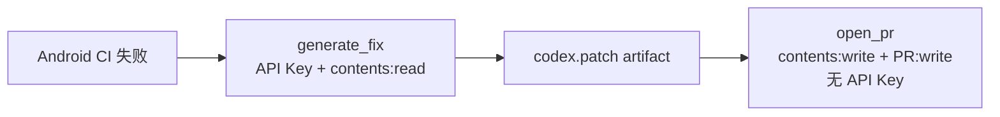

# 21｜构建与交付：把本地成功带进 CI

本地成功只是证据链的一段。CI 要从干净环境重新取得代码、JDK、Android SDK 和依赖，再独立证明测试、Lint 与构建能够复现。

这一讲有两条并行流水线：

1. **Android CI** 是确定性裁判；
2. **Codex Action** 提供审查或候选补丁，但不能替代编译器和测试。

配套文件：

- [Android CI](./配套文件/PocketTasks-codex/.github/workflows/android-ci.yml)
- [Codex PR 审查示例](./配套文件/PocketTasks-codex/.github/workflows/codex-pr-review.example.yml)
- [Codex 自动修复示例](./配套文件/PocketTasks-codex/.github/workflows/codex-autofix.example.yml)
- [审查 Prompt](./配套文件/PocketTasks-codex/.github/codex/prompts/review.md)

后两个文件以 `.example.yml` 结尾，不会自动运行。团队完成权限和费用评审后再改成 `.yml`。

## 先定义交付合同

PocketTasks 的普通 PR 至少需要：

```text
JVM 单元测试 → Lint → Debug APK → 测试与构建产物
```

涉及 Compose 交互或 Room Migration 时，再增加设备测试：

```text
模拟器启动 → connectedDebugAndroidTest → 测试报告
```

涉及发布时还需要签名、制品来源、版本和审批，但不应把发布密钥暴露给普通 PR 或 Codex 审查作业。

## 基础 Android CI

核心工作流如下：

```yaml
name: Android CI

on:
  pull_request:
  push:
    branches: [main]

permissions:
  contents: read

jobs:
  verify:
    runs-on: ubuntu-latest
    steps:
      - uses: actions/checkout@v5
      - uses: actions/setup-java@v4
        with:
          distribution: temurin
          java-version: "17"
      - uses: gradle/actions/setup-gradle@v4
      - run: ./gradlew :app:testDebugUnitTest :app:lintDebug :app:assembleDebug
```

四个细节不能省略：

- 使用仓库的 `./gradlew`，不要依赖 runner 的全局 Gradle；
- 给 GitHub token 最小 `contents: read` 权限；
- 不在普通验证 job 中加载签名凭据；
- 失败时仍上传测试和 Lint 报告。

## 设备测试应成为独立作业

模拟器慢、易受系统镜像和虚拟化影响，不要把它伪装成 JVM 测试的一部分。

配套工作流提供独立 `instrumented` job：

```yaml
- uses: reactivecircus/android-emulator-runner@v2
  with:
    api-level: 35
    arch: x86_64
    script: ./gradlew :app:connectedDebugAndroidTest
```

团队必须确定：

- API level 与 ABI；
- 是否每个 PR 都运行；
- 超时、重试和 flaky test 处理；
- Logcat、截图和测试报告的保留时间；
- Room 支持的最老升级版本。

设备测试失败不能通过无限重试“变绿”。先保存证据，再区分环境不稳定和产品缺陷。

## Codex Action 的准确职责

`openai/codex-action@v1` 会安装 Codex CLI，在提供 API Key 时启动 Responses API proxy，并按配置运行 `codex exec`。

它适合：

- 对 PR diff 生成结构化审查；
- 根据失败日志准备候选补丁；
- 生成发布说明或迁移清单；
- 执行已稳定、可重复的仓库任务。

它不适合成为唯一合并门禁。模型发现具有概率性，最终门禁仍应来自编译、测试、静态分析和明确人工审批。

## 安全的 PR 审查结构

审查 job 只需要读取代码：

```yaml
jobs:
  codex_review:
    if: github.event.pull_request.head.repo.full_name == github.repository
    permissions:
      contents: read
    outputs:
      final_message: ${{ steps.codex.outputs.final-message }}
    steps:
      - uses: actions/checkout@v5
        with:
          ref: refs/pull/${{ github.event.pull_request.number }}/merge
          fetch-depth: 0
          persist-credentials: false

      - name: Run Codex review
        id: codex
        uses: openai/codex-action@v1
        with:
          openai-api-key: ${{ secrets.OPENAI_API_KEY }}
          prompt-file: .github/codex/prompts/review.md
          output-file: codex-review.md
          sandbox: read-only
          codex-args: '["--ephemeral"]'
```

写 PR 评论放到第二个 job。这样：

- Codex job 有 API Key，但没有仓库写权限；
- 评论 job 有 PR 写权限，但没有 OpenAI API Key；
- checkout 禁止持久化 Git 凭据；
- fork PR 默认不进入带密钥的 job；
- 最终文字同时作为 artifact 保存，便于审计。

## 自动修复必须把“生成”和“写入”拆开

失败后自动修复的推荐结构：



第一份 job：

1. checkout 失败提交；
2. 在没有 API Key 的步骤中准备 JDK 和依赖；
3. Codex 复现失败并生成最小修复；
4. 只把 `git diff --binary` 保存成 patch artifact。

第二份 job：

1. 下载 patch；
2. `git apply --index`；
3. 建立 `codex/auto-fix-*` 分支；
4. 提交并创建 PR；
5. 不持有 OpenAI API Key。

这不是形式主义。仓库中的 Gradle 插件、测试代码和生命周期脚本都可能读取 job 环境变量，因此不要把 `OPENAI_API_KEY` 设成整个 job 的普通环境变量，再执行不受信任代码。

## Prompt 也要版本化

`.github/codex/prompts/review.md` 应明确：

- 只审查目标 diff；
- 先读 `AGENTS.md` 和相关 Spec；
- 发现必须包含文件、行号、影响和复现路径；
- 不把格式偏好升级成阻断问题；
- 没有发现时列出覆盖范围和未验证风险；
- 不修改 checkout。

Prompt 的变更本身也需要评审，因为它会改变 CI 行为。

## Android CI 失败时怎样让 Codex 排障

先保存原始日志，再给出窄任务：

```bash
gh run view <run-id> --log-failed > evidence/ci-failed.log
codex exec --ephemeral --sandbox read-only \
  "读取 evidence/ci-failed.log。区分环境、依赖、编译、测试和设备问题；
   给出最小复现命令，不修改仓库。"
```

如果日志含 token、签名路径、内部 URL 或用户数据，先脱敏再交给模型。

一份合格诊断应区分：

- 第一个根因错误；
- 后续级联错误；
- 在本地复现的精确命令；
- 当前证据不能证明的部分。

## 缓存不是越多越好

Gradle 官方 Action 可以管理常见缓存，但仍需关注：

- Wrapper 和依赖版本是否进入 cache key；
- 缓存损坏时怎样清除；
- 是否把本地或签名文件错误缓存；
- 配置缓存是否与自定义插件兼容。

首次建立 CI 时先保证无缓存也能成功，再优化耗时。

## 本讲实践

1. 在独立仓库中启用 `android-ci.yml`。
2. 创建一个测试失败的 PR，确认 job 失败且报告被上传。
3. 修复测试，确认 JVM、Lint、APK 都成功。
4. 审查 `codex-pr-review.example.yml` 的权限和触发条件。
5. 只有在组织允许、费用和密钥策略完成后，才改名启用 Codex workflow。

## 完成标志

- CI 能从干净环境构建 PocketTasks；
- JVM 与设备测试被清楚区分；
- Codex 审查 job 没有仓库写权限；
- 自动修复通过 patch artifact 跨 job 移交；
- OpenAI API Key 不暴露给仓库控制的构建脚本。

## 延伸阅读

- [Codex GitHub Action](https://learn.chatgpt.com/docs/github-action)
- [Codex 非交互模式](https://learn.chatgpt.com/docs/non-interactive-mode)
- [GitHub Actions 权限](https://docs.github.com/actions/security-for-github-actions/security-guides/automatic-token-authentication)
